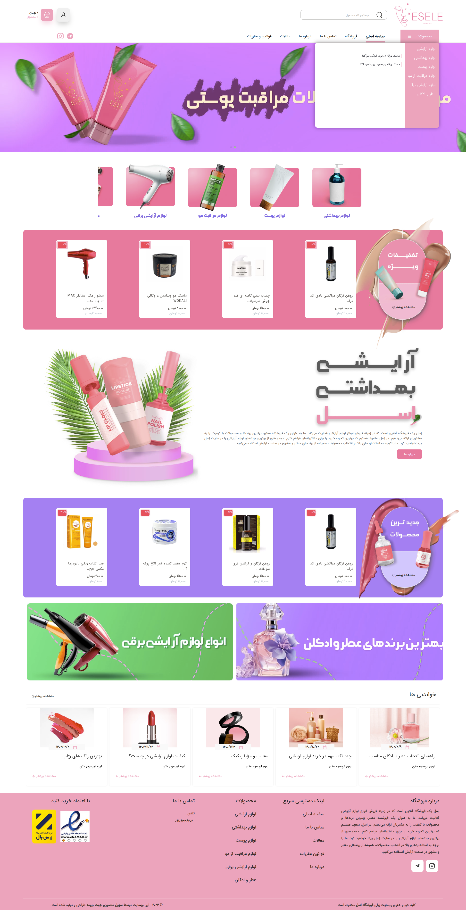
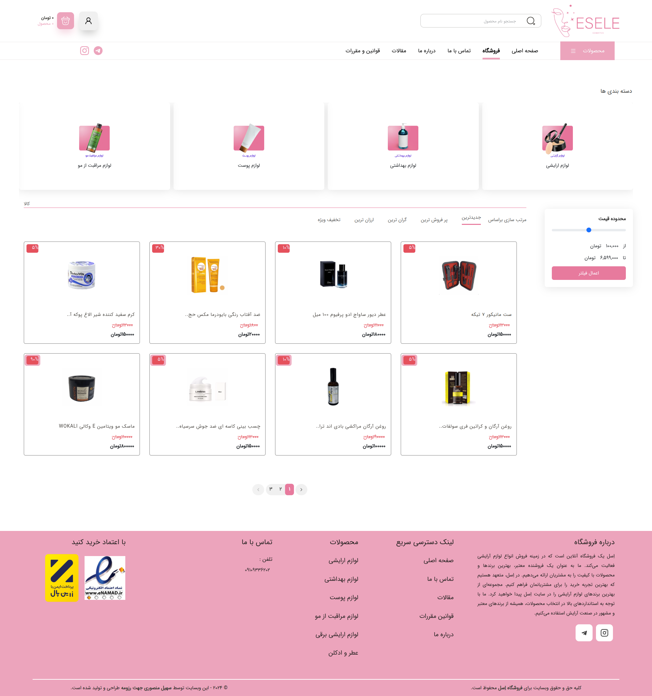
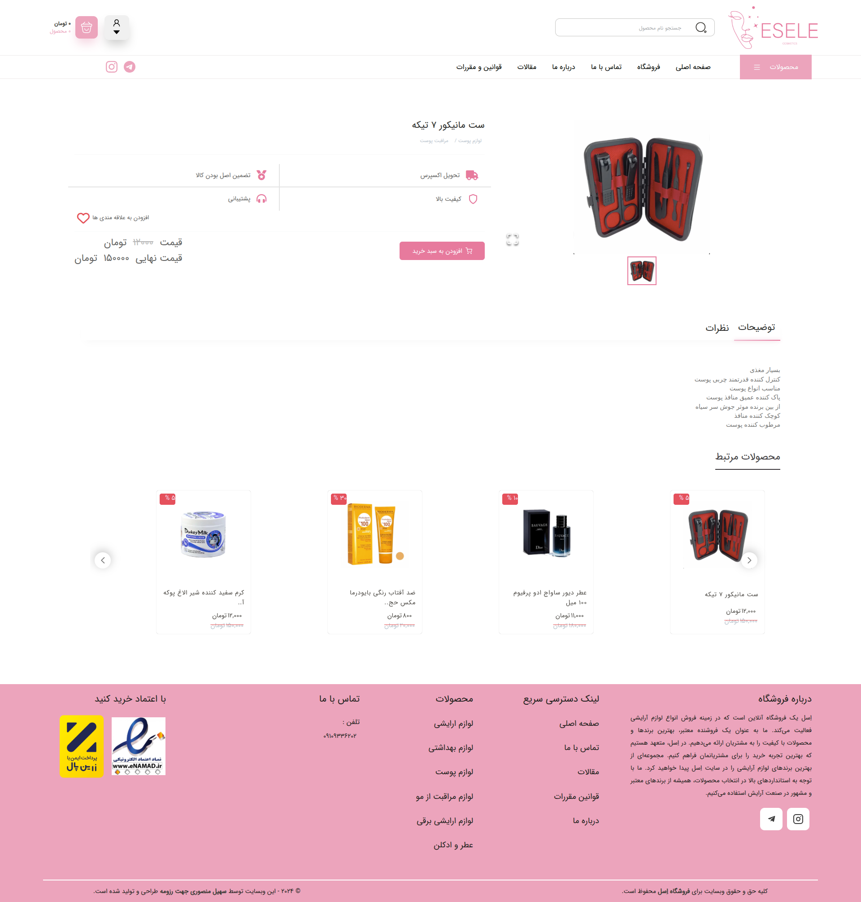
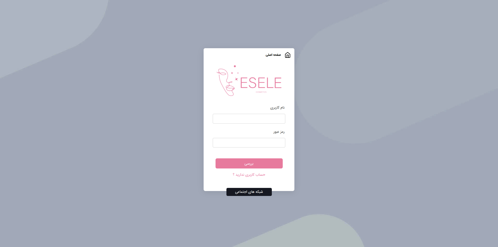
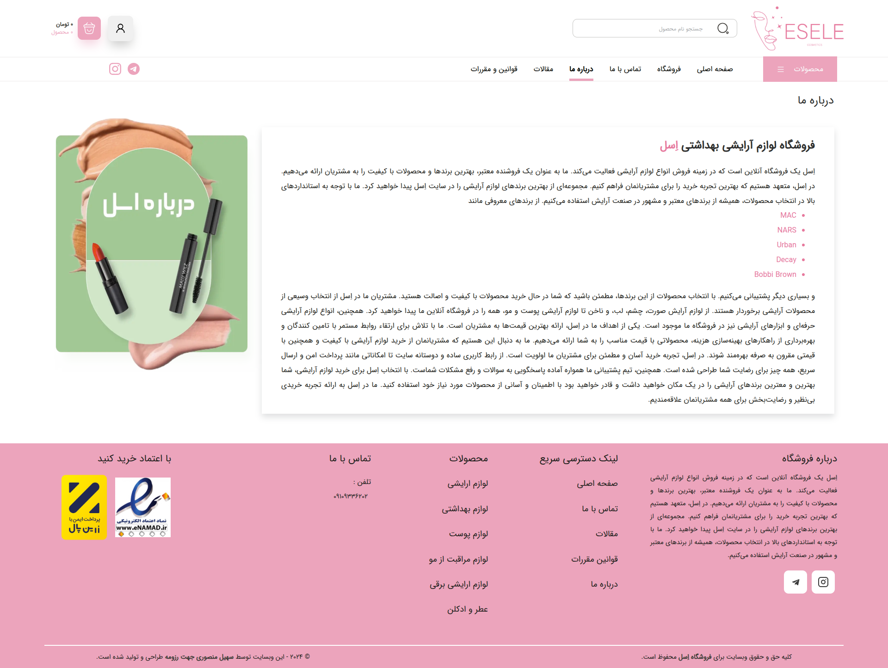
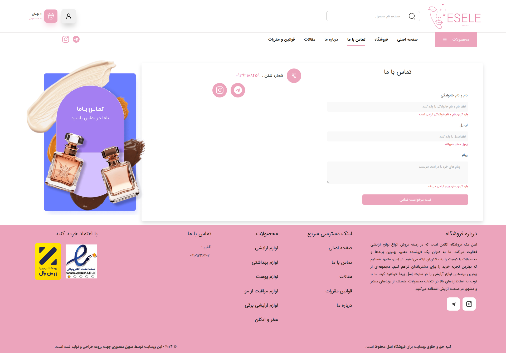
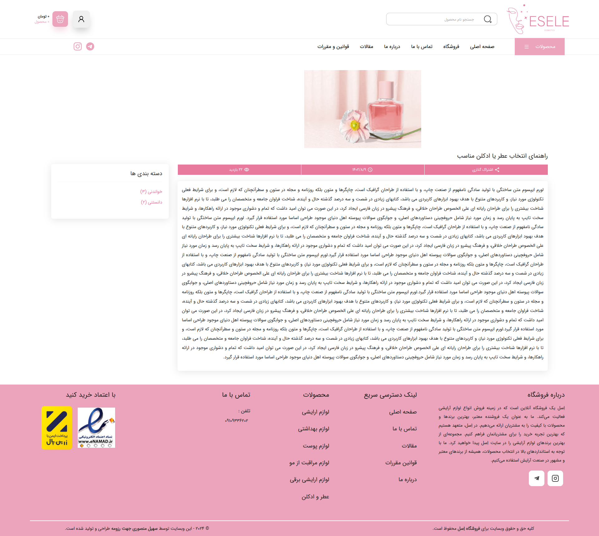
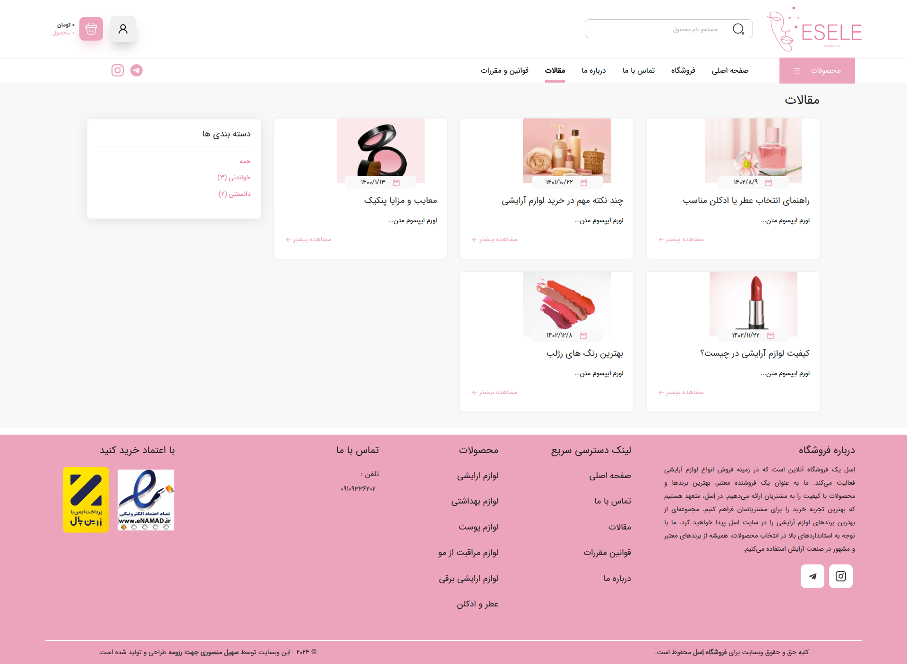
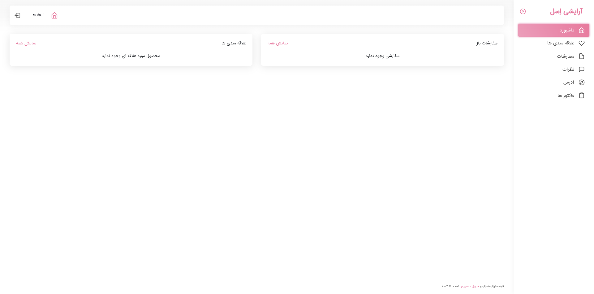

# 🛍️ Esele-Shop (React + PWA)

A modern practice e-commerce project for a cosmetics and personal care store, built with **React** and designed to simulate a real-world project. It includes both customer-facing pages and a **user panel**, with **PWA support** for mobile/desktop installation.

---

## 🚀 Features

- 🔐 **Authentication System** – Login and register functionality.
- 🛒 **Product Listing** – View products with categories and filters.
- 👀 **Product Details** – View product, add to cart, comment, and more.
- 📞 **Contact Page** – Submit inquiries via the contact form.
- 🔍 **Global Search** – Search across all categories and filter results.
- 📚 **Articles Page** – Browse informative articles.
- 🧺 **Cart System** – Add products to cart, view cart, and place orders.
- 👤 **User Panel** – View orders, favorites, and comments.
  - Test login:
    - **Username**: `soheil`
    - **Password**: `soheil1382`
- 📱 **PWA Support** – Install the app on mobile and desktop.

---

## 🛠️ Technologies Used

- **React**
- **React Router DOM**
- **Bootstrap** & **React-Bootstrap**
- **React-Spinners**, **React-Toastify**, **SweetAlert**
- **Formik**
- **Swiper**, **HTML**, **CSS**
- **JSON Server** – For simulating a backend (API)

---


## 📸 Screenshots

### HomePage


### ProductsPage


### ProductPage



### LoginPage


### AboutUsPage


### contactPage


### ArticlePage


### ArticlesPage


### UserPanelPage



## 📦 Installation & Run

```bash
# Clone the repository
git clone https://github.com/soheilMansoori/esele-shop

# Navigate into the project directory
cd esele-shop

# Install dependencies
npm install

# Start the project
npm start
